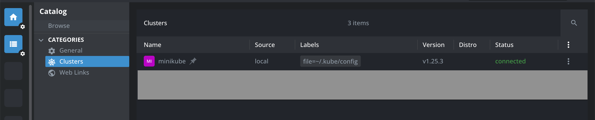

# Kube practise repository
Этот репозиторий сделан для отработки базовых знаний по k8s (kubernetes)

## Подготовка

Нам нужно установить некоторые штуки заранее

### Docker
Сам докер 
[docker install](https://www.docker.com/)

### Minikube
Локальный кубернетес для отработки практики

[minikube install](https://minikube.sigs.k8s.io/docs/start/?arch=%2Fmacos%2Farm64%2Fstable%2Fbinary+download)

[minikube 101 course](https://minikube.sigs.k8s.io/docs/tutorials/kubernetes_101/)
Для мака можно использовать brew

```shell
brew install minikube
```
### K9s
Терминальная утилита для работы с кубер-кластером

[k9s install](https://k9scli.io/topics/install/)

Для мака можно использовать команду

```shell
brew install derailed/k9s/k9s
```
### Lens
GUI IDE для работы с кубер кластером

[lens install](https://docs.k8slens.dev/getting-started/install-lens/)

## Подготавливаем кластер

Запускаем кубер кластер

```shell
minikube start
```

Запускаем дешборд миникуба

```shell
minikube dashboard
```

Для того, чтобы наш миникуб видел локальные образы, нам требуется собирать их в енв миникуба для этого:

```shell
eval $(minikube docker-env)
```

Собираем образ нашего приложения внутри миникуб енва

```shell
docker build -t kube-practice:0.1.0 .
```

Пишем первый деплоймент

```shell
kubectl create deployment kube-practice --image=kube-practice:0.1.0 --dry-run=client -o yaml > kube-practice_0.1.0.yaml
```

Можно теперь открыть и посмотреть конфигурацию деплоймента.
Далее применяем деплоймент конфигурацию

```shell
kubectl apply -f kube-practice_0.1.0.yaml
```

Чтобы наш сервис стал доступен в сети, нужно настроить сервис

```shell
kubectl expose deployment/kube-practice --type="NodePort" --port 8000 --dry-run=client -o yaml > kube-practice_service.yaml
```

Далее применяем конфигурацию сервиса

```shell
kubectl apply -f kube-practice_service.yaml
```

Нам нужно теперь пробросить порт из миникуба на нашу тачку

```shell
minikube service kube-practice --url
```

В терминале запустился код, примерно такой, клик по ссылке и заходим на страничку `/docs`

```shell
➜ minikube service kube-practice --url
http://127.0.0.1:54987
❗  Because you are using a Docker driver on darwin, the terminal needs to be open to run it.

```

Теперь мы можем подергать ручки в сваггере

### Открываем k9s

Вообще по идее все просто, откроется такая штука. Советую изучить хоткеи, в нашем случае мы хотим открыть деплойменты, поэтому жмем `:dp` + `[Enter]`

```shell
k9s
```


### Открываем Lens

Открываем ленс, находим наш кластер, потом Workfloads -> Deployments



## Вносим различные изменения

### Добавляем env переменную
В файле `kube-practice_0.1.0.yaml` добавляем в конфигурацию контейнера енв переменные

```yaml
    spec:
      containers:
      - image: kube-practice:0.1.0
        name: kube-practice
        resources: {}
        env:
          - name: SLEEP_TIME
            value: "10"
```

Теперь мы должны применить наш конфиг деплоймента, кубер сам поймет изменения и перезапустит деплоймент

```shell
kubectl apply -f kube-practice_0.1.0.yaml
```
Дергаем ручку `POST /sleep`, после чего
проверяем логи нашего pod'a или деплоймента (k9s, lens), мы должны увидеть такое

```shell
INFO:     Started server process [7]
INFO:     Waiting for application startup.
INFO:     Application startup complete.
INFO:     Uvicorn running on http://0.0.0.0:8000 (Press CTRL+C to quit)
[2024-09-08 18:37:49 INFO] root | sleep called
[2024-09-08 18:37:59 INFO] root | prepare answer
INFO:     172.17.0.1:21982 - "POST /sleep HTTP/1.1" 200 OK
[2024-09-08 18:38:24 INFO] root | sleep called
[2024-09-08 18:38:34 INFO] root | prepare answer
INFO:     172.17.0.1:47667 - "POST /sleep HTTP/1.1" 200 OK
```

Ну и наша ручка работала 10 секунд

### Deployment scaling

Для того, чтобы добавить подов нашему деплойменту мы должны его изменить. Это можно сделать несколькими способами

1. Изменяем `replicas` в деплойменте
```shell
spec:
  replicas: 5
```
после чего применяем наш новый конфиг

```shell
kubectl apply -f kube-practice_0.1.0.yaml
```

2. Применяем команду для скейлинга
```shell
kubectl scale deployments/kube-practice --replicas=5
```

После любого из способов проверьте кол-во подов у вашего деплоймента, их стало 5
Дергаем ручку несколько раз, убеждаемся, что трафик расходится по нескольким подам

Можно использовать `parallel.sh` скрипт для этого (измените свой порт)
```shell
chmod +x parallel.sh
./parallel.sh
```

Смотрим логи деплоймента и видим, что трафик разбежался по разным подам

```shell
 kube-practice-7dd8d8d4c9-4lhns INFO:     172.17.0.1:12237 - "POST /sleep HTTP/1.1" 200 OK                              ││ kube-practice-7dd8d8d4c9-4lhns [2024-09-08 18:52:10 INFO] root | prepare answer                                        ││ kube-practice-7dd8d8d4c9-4lhns [2024-09-08 18:52:10 INFO] root | prepare answer                                        ││ kube-practice-7dd8d8d4c9-4lhns INFO:     172.17.0.1:39836 - "POST /sleep HTTP/1.1" 200 OK                              ││ kube-practice-7dd8d8d4c9-jjgtl [2024-09-08 18:52:10 INFO] root | prepare answer                                        ││ kube-practice-7dd8d8d4c9-jjgtl INFO:     172.17.0.1:11702 - "POST /sleep HTTP/1.1" 200 OK                              ││ kube-practice-7dd8d8d4c9-jjgtl INFO:     172.17.0.1:10878 - "POST /sleep HTTP/1.1" 200 OK                              │
│ kube-practice-7dd8d8d4c9-jjgtl [2024-09-08 18:52:10 INFO] root | prepare answer                                        │
│ kube-practice-7dd8d8d4c9-xzfdg [2024-09-08 18:52:10 INFO] root | prepare answer                                        │
│ kube-practice-7dd8d8d4c9-xzfdg INFO:     172.17.0.1:48193 - "POST /sleep HTTP/1.1" 200 OK                              │
│ kube-practice-7dd8d8d4c9-xzfdg [2024-09-08 18:52:10 INFO] root | prepare answer                                        │
│ kube-practice-7dd8d8d4c9-xzfdg INFO:     172.17.0.1:20277 - "POST /sleep HTTP/1.1" 200 OK
```

### Катим новый релиз
Для начала давай запилим новую фичу, в наш файлик `main.py` добавляем новую ручку

```python
@app.get(
    "/ping",
    responses={"200": {"content": {"application/json": {"example": {"status": "OK"}}}}},
)
async def ping() -> dict:
    """Health check for service"""
    return {"status": "OK"}
```

Теперь собираем новый образ. Внимание! делаем это внутри миникуб енва, чтобы наш образ подтянулся туда

```shell
eval $(minikube docker-env)
docker build -t kube-practice:0.2.0 .
```

_*Предварительно открой деплоймент со списком его подов (например в k9s)_

После сборки, нам нужно поменять версию образа в деплойменте. Это опять можно сделать несколькими путями, вот два классических
1. Создаем новый файл kube-practice_0.2.0.yaml. Копируем старое содержимое и меняем тег образа:

```yaml
    spec:
      containers:
      - image: kube-practice:0.2.0  # вот тут поменяли
        name: kube-practice
        resources: {}
        env:
          - name: SLEEP_TIME
            value: "10"
```

применяем конфиг

```shell
kubectl apply -f kube-practice_0.2.0.yaml 
```

2. Мы можем отредактировать деплоймент прямо в наших IDE (почитай доку к твоему инструменту). По факту, произойдет тоже самое
3. Позвать команду для смены образа

```shell
kubectl set image deployment/kube-practice kube-practice=kube-practice:0.2.0
```

В итоге ты увидишь перекатку контейнеров как на скрине


Открываем наш сваггер `/docs` и видим новую ручку `GET /ping`

_*Попробуй накатить несуществующий тег, посмотри как отреагирует кубер и что произойдет_


# TODO: настроить хелсчек, сделать пинг ручку с рандомным временем ответа и  посмотреть как будут закатываться контейнеры


### Придумать чтото с нагрузкой, настроить автоскейлинг, подать нагрузку, посмотреть как поды будут подниматься

### Сделать портфорвард к себе